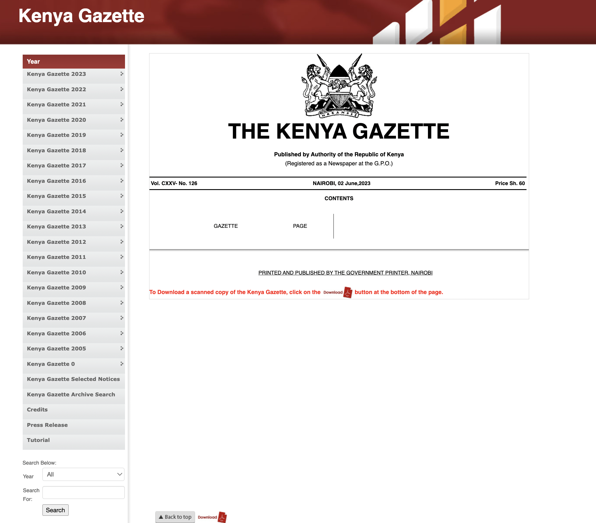
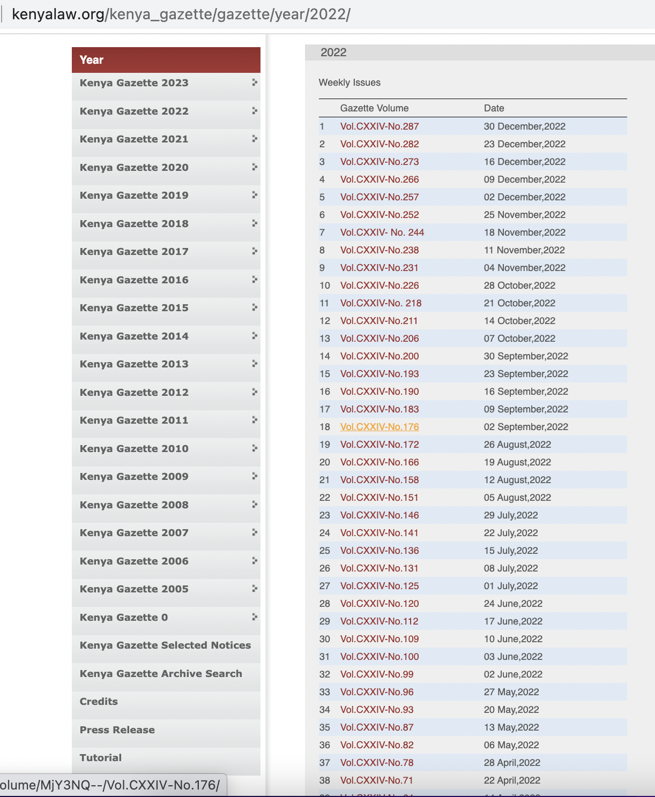
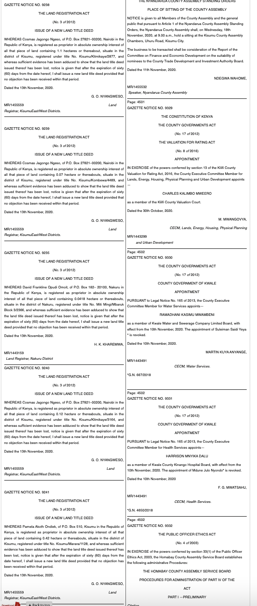
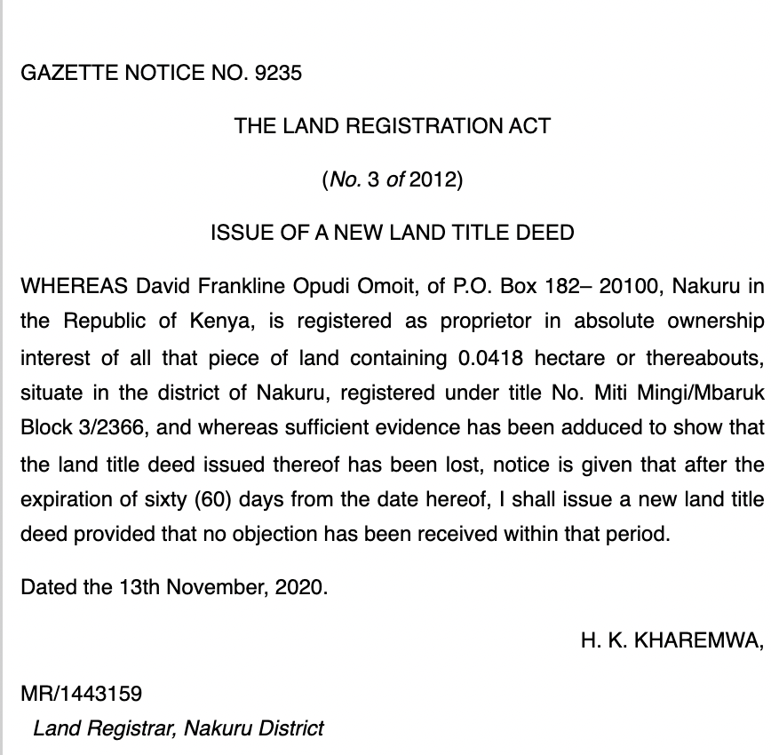
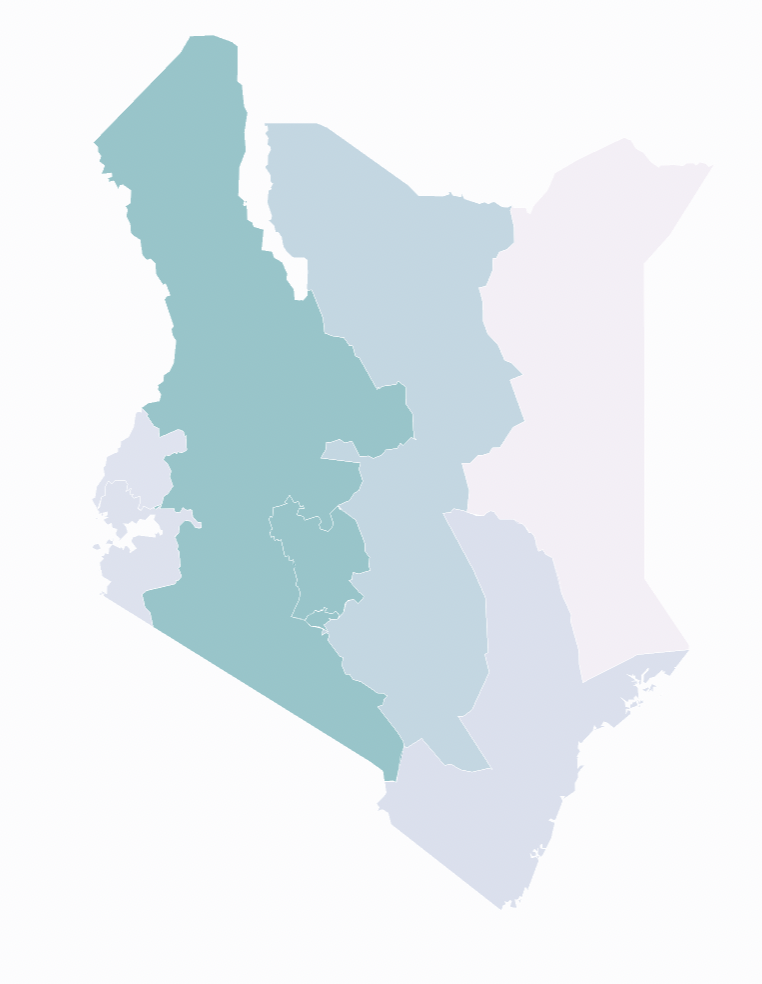

# [Creating a database with a list of the issue of new land title deeds in Kenya.](https://ivynyayieka.github.io/kenya_gazette_land/)

This is a project scraping HTML pages of weekly Kenya Gazette notices starting from 2010 in order to retrieve and categorise land-related notices. The result is a database with more than 200,000 rows of land-related notice entries.


### Getting the Data
.gif)


* [Weekly Kenya Gazette notices](http://kenyalaw.org/kenya_gazette/gazette)
* [Districts, areas and population](http://www.statoids.com/yke.html)
* [Shapefile of Kenyan provinces](https://www.igismap.com/kenya-shapefile-download-boundary-line-administrative-state-and-polygon/)

## The Kenya Gazette

## This is what the home page of the Kenya Gazette looks like



## This is what the landing page for one year of gazette notices looks like



# How I got the urls for each year 

```
#From 2010 to 2020
#Weekly issues

#Every url for a year's worth of gazette notices starts with this url_year_base below

url_year_base="http://kenyalaw.org/kenya_gazette/gazette/year/"

#I am trying to scrape for the years with htmls, that is 2010 to 2020
#Getting the range from 2010 to 2021 so 2020 can be included, then setting it into a list

years=list(range(2010,2021))

#to get each url for each year containing a list of the year's gazette notices

year_link_dict_list=[]

for year in years:
    year_link_dict={}
    url_year=url_year_base+str(year)
#     print(url_year)
    year_link_dict['year']=year
    year_link_dict['url_year']=url_year
    year_link_dict_list.append(year_link_dict)
    
url_year_links = [x['url_year'] for x in year_link_dict_list]
```

# How I got the HTML content on each year's page for all gazette notices within it.

### Here, as a list of dictionaries, I get the following information:
* year
* url for the year
* url for each gazette notice within the year.
I then exploded this so that each html for a weekly gazette notice gets its own row


```
    
for year_link_dict in year_link_dict_list:
    print("$$$$$$$$$$$$")
    url_year_link=year_link_dict['url_year']
    print(url_year_link)
    year_raw_html = requests.get(url_year_link).content
    print(type(year_raw_html))
    
    #assign year_urls_soup_doc as the doc holding parsed html 
    #learn type of year_urls_soup_doc
    year_urls_soup_doc = BeautifulSoup(year_raw_html, "html.parser")
    print(type(year_urls_soup_doc))
    print("________")
    
    
    #These are the links on the page for all gazette notices
    links_within_year=year_urls_soup_doc.select('#content')

    #Both weekly and special gazette notices sections
    sections_within_year = str(links_within_year).split('<p>') 
    
    #To get weekly issues only use sections_within_year[1]
    #Then split it by tr to get each entry of a gazette notice
    sections_within_year[1].split('<tr>')
    weekly_section=sections_within_year[1]
    weekly_section_entries=weekly_section.split('<tr>')
    
    
    link_href_list=[]

    for link_within_section in weekly_section_entries:
        try:
            link_href=link_within_section.split('<td>')[2].split('"')[1]
#             print(link_href)
#             print("______")
            link_href_list.append(link_href)
            year_link_dict['gazette_links']=link_href_list

        except:
            pass

#     print(year_link_dict)
    
# print(year_link_dict_list)
```

## This is what the one section of land-related notices in the Weekly Kenya Gazette looks like



# How I created a function that scrapes a url for a gazette notice to extract the following information:

* volume number: volume_num
* volume date: volume_date
* volume url: volume_url
* title of notice's number: notice_num_title
* title of notice's act: notice_act_title
* notice's capital and section: notice_num_year
* notice's subtitle: notice_sub_title
* notice's full body of info: notice_body
* specific notice's date: notice_date
* name of notice's registrar: notice_registrar_name
* number and location of notice: notice_num_loc
* notice's location: notice_loc

```
def scrape_url(my_url):
    try: 
        raw_html = requests.get(my_url).content

        #assign soup_doc as the doc holding parsed html 
        #learn type of soup_doc
        soup_doc = BeautifulSoup(raw_html, "html.parser")

        #Finding volume number to keep track of what data is from what source in larger csv
        
            
        

        # creating a list of all divs with id starting with GAZETTE NOTICE
        list_all_divs= [elem.parent.parent for elem in soup_doc.find_all("em", text=re.compile("(Land Registrar|Registrar of Land|Registrar of Titles)", re.IGNORECASE))]
        #The parent of p is a div
        #print("Found", len(list_all_divs), "potentials")
        #create function for making a dictionary out of each entry within the list of all divs
        def class_to_dictionary(list_of_items):
            #initialise keys of dictionary
            dict_titles=['volume_num',
                     'volume_date',
                     'volume_url',
                     'notice_num_title',
                     'notice_act_title',
                     'notice_num_year',
                     'notice_sub_title',
                     'notice_body',
                     'notice_date',
                     'notice_registrar_name',
                     'notice_num_loc',
                     'notice_loc']
            
            #initialise empty list which will contain all new notice entries
            all_new_notice_entries=[]
            
            #For one entry within the list of items which is a variable you will pass in the function
            #list_of_items will usually be the large capsules containing gazette entries
            #mostly for the ones I have seen there are two such capsules among these that have land registration act entries
            
            for one_item in list_of_items:
                
                
                #if the words LAND REGISTRATION ACT or Land Registrar appear in the text
                if "LAND REGISTRATION ACT" in one_item.text or "Land Registrar" in one_item.text:

                    #Then split one_item at the <hr/> point
                    entry_deets = str(one_item).split('<hr/>') 
                    
                    #now entry_deets is a list of notices within the capsule
                    for entry_deet in entry_deets:
                        
                        #one entry_deet is a notice within the capsule
                        
                        #initialise a list which I plan to zip to dict_titles to make a dictionary
                        entry_deet_full_list=[]
                        
                        #since I changed to string to split on hr
                        #I need to return the content to beautiful soup classes

                        entry_deet_soup = BeautifulSoup(entry_deet, "html.parser")
                        
                        #now make a list of all p's within the gazette notice
                        entry_deet_paragraphs = entry_deet_soup.find_all('p')
                        
                        #When converting to text I kept getting Xa0
                        # Normalize unicode data like this
        #               # normalize("NFKD", x.text)
                        # https://stackoverflow.com/questions/10993612/how-to-remove-xa0-from-string-in-python
                        entry_deet_paragraphs = [normalize("NFKD", x.text) for x in entry_deet_paragraphs if x.text.strip()!='']
                        if len(entry_deet_paragraphs) == 0:
                            continue


                        #Introducing number, date and url
                        #Then the rest comes from 
                        volume_num=soup_doc.select(".gazette-content #content div")[2].text
                        volume_date=soup_doc.select(".gazette-content #content div")[3].text
                        volume_url=my_url
                        notice_num_title=entry_deet_paragraphs[0]
                        notice_act_title=entry_deet_paragraphs[1]
                        notice_num_year=entry_deet_paragraphs[2]
                        notice_sub_title=entry_deet_paragraphs[3]
                        notice_body=entry_deet_paragraphs[4]
                        notice_date=entry_deet_paragraphs[5]
                        notice_registrar_name=entry_deet_paragraphs[6]
                        notice_num_loc=entry_deet_paragraphs[7]
                        try:
                            notice_loc=(entry_deet_soup.find_all('p')[-1]).text.split(',')[1]
                        except:
                            notice_loc="Na"
                        
                        entry_deet_full_list.append(volume_num)
                        entry_deet_full_list.append(volume_date)
                        entry_deet_full_list.append(volume_url)
                        entry_deet_full_list.append(notice_num_title)
                        entry_deet_full_list.append(notice_act_title)
                        entry_deet_full_list.append(notice_num_year)
                        entry_deet_full_list.append(notice_sub_title)
                        entry_deet_full_list.append(notice_body)
                        entry_deet_full_list.append(notice_date)
                        entry_deet_full_list.append(notice_registrar_name)
                        entry_deet_full_list.append(notice_num_loc)
                        entry_deet_full_list.append(notice_loc)


        #             #     print(new_deet_list)

                        first_rep = dict(zip(dict_titles,entry_deet_full_list))
        #         #         print(first_rep)

        #         #         print("######")

                        all_new_notice_entries.append(first_rep)
            return all_new_notice_entries


        data = class_to_dictionary(list_all_divs)
        return data
    except Exception as e:
#         raise e
        pass
```

# How I scraped each gazette notice:
* Use the function created to now scrape through all gazette links which were earlier scraped and saved into the df_links gazette links. Save it into a large list and then create a dataframe from it
* Now merge the data in df_links to the new dataframe df

# How I incorporated district data
* Read data on Districts, Population and Area and merge it to the location information in the dataframe
* This data is important so that I can normalise the data on population but also so that I can get the code that I can use to group the data by provinces
* Clean up the districts' names in the dataframe to make it possible to join with districts dataframe
* Merge to the main dataframe to include the districts' information

# How I used regex and other relevant scraping techniques to extract more information from the notices for categories

## This is what one land-related gazette notice looks like:



### Here are some of the columns created:

* First person named in a title: first_named
* Area of land referenced: acres_hectares
* Title deed number: title_number
* ID number of first person named: first_ID
* Address details of first person named: first_address
* LR number: lr_num
* Municipality referenced: municipality
* Second person named in a title: second_person
* IR number: ir_num
* Number of days to expiration: days
* Succession cause number: succession
* township: township
* district: in_the_district_of
* province code: province_code

### Here is an example of the use of regex to extract number of days' notice administered
```
df_large_districts['days']=df_large_districts.notice_body.str.extract("of [\w]+ [(]([\d]+)[)] days") 
df_large_districts['days'].sample(12)
```
# How I merged the resulting data to data on provinces
I wanted to have the option to group the data by provinces <br/>
I made a dataset that matched every province code in the dataset to a province in Kenya <br/>
I merged the resulting data to the main dataframe

# How I mapped the dataset
Having grouped the dataset by provinces, I made a chloropleth map showing the distribution of land-related gazette notice activity by province by joining the dataset to a shapefile of Kenya's provinces

